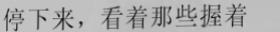

# Convolutional Recurrent Neural Network

This software implements the Convolutional Recurrent Neural Network (CRNN) in pytorch in paper:

**An End-to-End Trainable Neural Network for Image-based Sequence Recognition and Its Application to Scene Text Recognition**,
Baoguang Shi, Xiang Bai, Cong Yao,
PAMI 2017 [[arXiv](https://arxiv.org/abs/1507.05717)]

## What is it?

This code implements: (args.arch)

1. DenseNet + CTCLoss (`densenet_cifar`, `densenet121` with pre-trained model)
2. ResNet + CTCLoss (`resnet_cifar`)
3. MobileNetV2 + CTCLoss (`mobilenetv2_cifar` with pre-trained model)
4. ShuffleNetV2 + CTCLoss (`shufflenetv2_cifar`)

## Prerequisites

In order to run this toolbox you will need:

- Python3 (tested with Python 3.6+)
- PyTorch deep learning framework (tested with version 1.0.1)

## Demo

The demo reads an example image and recognizes its text content. See the [demo notebook](./demo.ipynb) for all the details.

Example image:

Expected output:

    -停--下--来--，--看--着--那--些--握--着------ => 停下来，看着那些握着

## Usage

- Navigate (`cd`) to the root of the toolbox `[YOUR_CRNN_ROOT]`.
- Resize the height of an image to 32, and keep the spatial ratio of the image.

### Datasets

Refer to YCG09's [SynthText](https://github.com/YCG09/chinese_ocr), the image size is 32x280, origin image can be downloaded from [BaiduYun](https://pan.baidu.com/s/1QkI7kjah8SPHwOQ40rS1Pw) (pw: lu7m), untar it into directory `[DATASET_ROOT_DIR]/images`.

### Annotation file format

In each line in the annotation file, the format is:

    img_path encode1 encode2 encode3 encode4 encode5 ...

where the `encode` is the sequence's encode token code.

For example, there is task identifying numbers of an image, the `Alphabet` is "0123456789". And there is an image named "00320_00091.jpg" in folder `[DATA]/images`, its constant is "99353361056742", after conversion, there should be a line in the `[DATA]/train.txt` or `[DATA]/dev.txt`.

    00320_00091.jpg 10 10 4 6 4 4 7 2 1 6 7 8 5 3

*Note.* the encoder code `0` is reserved for *CTC blank token*.

### Alphabet

Altogether 5989 characters, containing Chinese characters, English letters, numbers and punctuation, can be downloaded from [OneDrive](https://1drv.ms/t/s!AtlbCejIR3IcgQjX2JYMSC0tEcpx) or [BaiduYun](https://pan.baidu.com/s/1XCUBTtWx9K6fgQeINjCK-g) (pw: d654), put the downloaded file `alphabet_decode_5990.txt` into directory `[DATASET_ROOT_DIR]`.

### Pretrained Model

For the limitation of GPU, I have only trained the CRNN with `densenet121` architectures for only 1 epoch and `mobilenetv2_cifar` architectures for only 2 epochs.

The pre-trained `densenet121` checkpoint can be found from [OneDrive](https://1drv.ms/u/s!AtlbCejIR3IcgQkwuQkN1aAoPHX8) or [BaiduYun](https://pan.baidu.com/s/163fBRV6S8WgwImPHnee_gg) (pw: riuh) (Trained for 1 epoch, with accuracy 97.55\%), and the pre-trained `mobilenetv2_cifar` checkpoint can be found from [OneDrive](https://1drv.ms/u/s!AtlbCejIR3IcgQphV1H6x1fhEA1S) or [BaiduYun](https://pan.baidu.com/s/1mPwq2ptD-1q-_E-E-Fz8wA)(pw: n2rg) (Trained for 2 epochs, with accuracy 97.83\%).

### Training

Training strategy:

    python ./main.py --dataset-root [DATASET_ROOT_DIR] --arch densenet121
        --alphabet [DATASET_ROOT_DIR]/alphabet_decode_5990.txt
        --lr 5e-5 --optimizer rmsprop --gpu-id [GPU-ID]
        --not-pretrained

The initial learning rate of training `densenet121` architecture is `5e-5`, and the initial learning of training `mobilenetv2_cifar` architecture is `5e-4`.

### Testing

Use trained model to test:

    python ./main.py --dataset-root [DATASET_ROOT_DIR] --arch densenet121
        --alphabet [DATASET_ROOT_DIR]/alphabet_decode_5990.txt
        --lr 5e-5 --optimizer rmsprop --gpu-id [GPU-ID]
        --resume densenet121_pretrained.pth.tar --test-only

## Reference
- [CRNN origin pytorch implementation](https://github.com/meijieru/crnn.pytorch)
- [CIFAR10 with PyTorch](https://github.com/kuangliu/pytorch-cifar)
- [Efficient densenet pytorch](https://github.com/gpleiss/efficient_densenet_pytorch)
